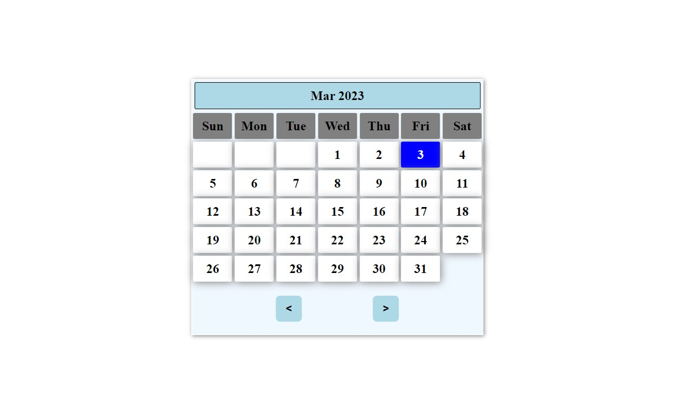

# Basic_calender_App

This is Basic Calender App it is created as part of learning Vanilla Javascript.

## Live Demo : 
[check Here](https://basic-calender-app.netlify.app/)

<div align="center">


</div>

## Test in Local
if u want to test it u can directly clone this project or or u can create files in ur local simply copy paste the code from the github and simply run the live server or open the ``` index.html``` file from the folder structure.

+ steps to run the Live server:
    + Add the Live server extension in Vscode.
    + do ``` ctrl+shift+p ``` and search "Live Server".


